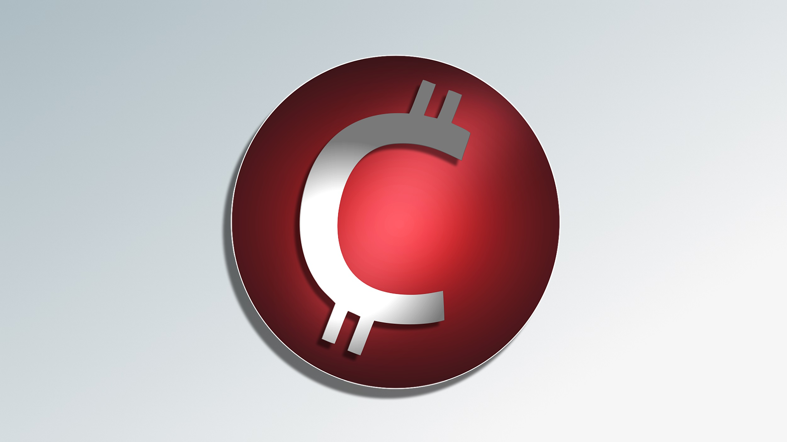

Cducoin 
========

Download wallets:
----------

- Wallets available for downloads here: https://github.com/cducoin-official/cducoin/releases/latest

Specifications:
----------------------

https://cducoin.org

• ASICS friendly

• 51% attacks resistant

• Adopts Segwit transations

• Uses the POW (Proof of Work)

• Algorithm:        SHA256

• Block Time:       6 seconds

• Block Reward:     6 CDU

• Difficulty:       16 blocks

• Halving:          700 mil blocks (133 years)

• Ticker:           CDU

• Block size:       4mb

• P2P Port:         8077

• RPC Port:         8076

• Max supply:       8,399,999,992

• POW Confirmations:   26

Links
----------------

• Website: https://cducoin.org

• Explorer: https://explorer.cducoin.org

• Paper Wallet: https://paperwallet.cducoin.org

• Mining Pool: https://mining.cducoin.org

• Discord: https://discord.gg/eyAvWEwnfm

• Telegram: https://t.me/CducoinOfficial

• Forum: https://bitcointalk.org/index.php?topic=5346761

License
-------

Cducoin Core is released under the terms of the MIT license. See [COPYING](COPYING) for more
information or see http://opensource.org/licenses/MIT.

